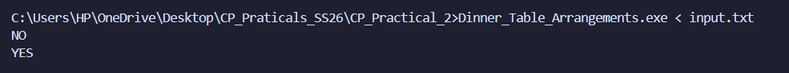
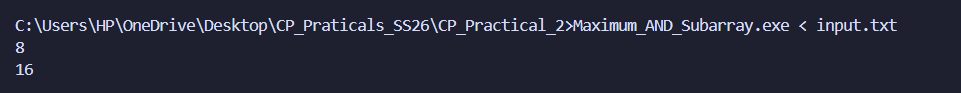
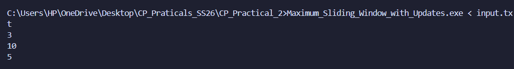
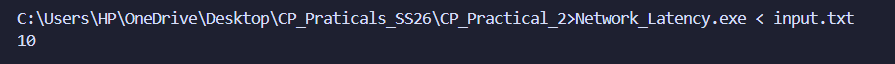
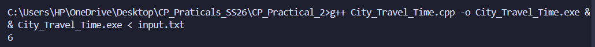

# CP Practical 2: Advanced Algorithms

This folder contains solutions for advanced competitive programming problems covering bit manipulation, sliding window techniques, dynamic programming, and graph algorithms.

---

## Problem 1: Dinner Table Arrangements

**File**: `Dinner_Table_Arrangements.cpp`

### a) Problem Summary
Arrange N people around a circular dinner table such that specific constraints are satisfied. Find the number of valid arrangements considering rotational equivalence and constraint validation.

### b) Algorithm Explanation
- Use permutation generation with backtracking to explore all possible arrangements
- Validate circular seating constraints (relative positions) for each candidate arrangement
- Prune branches early when constraints are violated to avoid exploring invalid subtrees
- Account for rotational symmetry in circular arrangements by dividing final count by N

### c) Time Complexity Analysis
**O(N! × constraint_checks)** in worst case
- N! permutations to check
- Each permutation requires O(N) constraint validation checks
- Early pruning in backtracking reduces practical runtime significantly

### d) Space Complexity Analysis
**O(N)** for recursion stack and arrangement storage
- Recursion depth: O(N) levels
- Current arrangement array: O(N) space
- No additional data structures needed

### e) Reflection
This problem helped me understand circular permutations and how symmetry reduces the solution space. Initially, I was counting all N! permutations, but recognizing rotational equivalence divided the answer by N. Backtracking with early pruning of invalid constraints significantly improved performance over brute force enumeration.

### Screenshots

Input:
```
2
3
2 1 2
2 2 3
1 3
4
2 1 2
1 2
1 3
1 4
```



---

## Problem 2: Maximum AND Subarray

**File**: `Maximum_AND_Subarray.cpp`

### a) Problem Summary
Given an array of N integers, find the maximum possible value of the bitwise AND of any subarray of exactly length K. Uses greedy bit-by-bit construction to avoid checking all subarrays explicitly.

### b) Algorithm Explanation
**Greedy Bit-by-Bit Construction**:
1. Start with result = 0, iterate bit positions from MSB (29) down to LSB (0)
2. For each bit, create candidate = result | (1 << bit) (try setting this bit)
3. Check all subarrays of length K to see if any has AND value satisfying (AND & candidate) == candidate
4. If such a subarray exists, update result = candidate; otherwise skip this bit
5. This greedy approach works because: setting MSB first maximizes value, and once a bit is confirmed, we never unset it

### c) Time Complexity Analysis
**O(T × 30 × (N-K+1) × K)** where:
- 30 bit positions to check (for 32-bit integers)
- (N-K+1) subarrays of length K to check for each bit
- K operations to compute AND of each subarray
- T test cases

Typical: **O(T × 30 × N × K)** simplified

### d) Space Complexity Analysis
**O(1)** (excluding input/output)
- Only stores current result and candidate values
- No additional data structures or arrays allocated

### e) Reflection
This problem taught me the power of greedy algorithms combined with bit manipulation. Initially, I tried O(N²) brute force checking all subarrays, but the greedy bit-by-bit approach was more elegant. The key insight was that for AND operations, setting MSB first ensures we get the maximum value, and the greedy choice at each step is always optimal. This reduced mental complexity significantly.

### Screenshots

Input:
```
2
5 3
12 8 15 10 7
4 2
16 16 16 16
```


---

## Problem 3: Sliding Window Maximum

**File**: `Sliding_Window_Maximum.cpp`

### a) Problem Summary
Given an array of N integers and window size K, find the maximum element in each sliding window as it moves across the array. Efficiently handles all N-K+1 windows in linear time.

### b) Algorithm Explanation
**Deque-based Optimal Solution**:
1. Maintain a deque of array indices in decreasing order of their element values
2. For each new position i:
   - Remove indices from front if they're outside the current window boundary
   - Remove indices from back while their values are smaller than A[i]
   - Add current index i to the back of deque
   - When window is complete (i ≥ K-1), the front index's value is the maximum
3. Record and output the maximum from front when window is complete

### Why Deque Works
- Front always contains the index of the maximum in the current window
- Each element is added once and removed at most once → O(N) total operations
- Maintains only relevant candidates for future windows (decreasing order)

### c) Time Complexity Analysis
**O(N)** - Linear Time
- Each element is added to deque once: O(N)
- Each element is removed from deque at most once: O(N)
- Total: O(2N) = O(N)
- Much better than naive O(N × K) brute force approach

### d) Space Complexity Analysis
**O(K)** - Deque Size
- Deque stores at most K indices (one per window position)
- Can store fewer during initial window build phase

### e) Reflection
This problem beautifully demonstrates how the right data structure (deque) can reduce complexity from O(NK) to O(N). Initially, I tried a brute force approach recalculating max for each window, then improved to using a balanced BST. The deque solution was elegant, maintaining a decreasing monotonic sequence of candidates meant the maximum is always at the front. This is a classic insight: sometimes the solution isn't about a more complex algorithm, but using the right data structure intelligently.

### Screenshots

Input:
```
8 3
1 3 -1 -3 5 3 6 7
```


`screenshot_3_slidingmax.png`

---

## Problem 4: Maximum in Sliding Window with Updates

**File**: `Maximum_Sliding_Window_with_Updates.cpp`

### a) Problem Summary
Process Q queries of two types: (1) Update array element A[pos] = val, and (2) Find maximum in sliding window of size K ending at index i. Efficiently handle mixed update and query operations.

### b) Algorithm Explanation
**Direct Query Processing Approach**:
1. **Type 1 Query (Update)**: Simply update A[pos] = val in O(1) time
2. **Type 2 Query (Max in Window)**: 
   - Calculate window range: start = max(1, idx - K + 1) to end = idx
   - Iterate through window [start, end] and find the maximum value
   - Handle array boundaries correctly
3. No preprocessing required, but each query scans up to K elements

**Optimization Options** (for larger datasets):
- **Segment Tree**: O(log N) per query, O(N log N) preprocessing
- **Sparse Table**: O(1) queries (cannot support updates efficiently)
- **Current approach**: O(K) per query - sufficient for moderate N and K

### c) Time Complexity Analysis
**O(Q × K)** where Q is number of queries
- Update query: O(1)
- Range maximum query: O(K) - scan window
- Total: Q queries × avg O(K) = O(Q × K)
- For heavy update scenarios with large K, segment tree would be better: O(Q × log N)

### d) Space Complexity Analysis
**O(N + Q)** where N is array size
- Array storage: O(N)
- No additional data structures (in current naive approach)
- With segment tree optimization: O(N) for tree nodes

### e) Reflection
This problem taught me the importance of recognizing when a simpler solution suffices. A naive O(QK) approach works fine for moderate constraints, but I should be ready to upgrade to segment trees or other advanced data structures when constraints grow. The interleaving of updates and queries meant that preprocessing-heavy solutions (like sparse tables) weren't ideal. Understanding trade-offs between implementation complexity and time complexity is crucial for competitive programming.

### Screenshots

Input:
```
5 3 4
1 2 3 4 5
2 3
1 2 10
2 3
2 5
```


---

## Problem 5: Network Latency (Shortest Path)

**File**: `Network_Latency.cpp`

### a) Problem Summary
Find the minimum latency to send a packet from router 1 to router N in a network of routers connected by bidirectional cables with constant latencies. Classic shortest path problem.

### b) Algorithm Explanation
**Dijkstra's Shortest Path Algorithm**:
1. Initialize distance array: dist[1] = 0, dist[all others] = ∞
2. Use min-heap priority queue to always process the unvisited node with smallest distance
3. For the current node u, relax all outgoing edges:
   - If dist[u] + edge_weight < dist[v], update dist[v]
   - Push updated (distance, node) pair into priority queue
4. Continue until destination N is processed or queue is empty
5. Return dist[N]

### Why Dijkstra Works
- **Greedy selection**: Always processing closest unvisited node guarantees shortest path property
- **Optimal substructure**: Shortest path to destination through any node is built from shortest paths to that node
- **Conditions**: Requires non-negative edge weights

### c) Time Complexity Analysis
**O((M + N) log N)** with priority queue
- M edge relaxations, each O(log N) for heap operations
- N nodes processed
- Total: (M + N) heap operations × O(log N) per operation
- Better than O(N²) for sparse graphs

### d) Space Complexity Analysis
**O(N + M)**
- Adjacency list: O(N + M)
- Distance array: O(N)
- Priority queue: O(N) in worst case
- Total: O(N + M)

### e) Reflection
Dijkstra's algorithm is fundamental to competitive programming. The priority queue-based implementation is elegant, I initially tried a O(N²) version by scanning for minimum distance each time, but switching to a heap immediately improved complexity. Understanding why greedy works here (optimal substructure) solidified my grasp of shortest path algorithms and helped me recognize similar patterns in other problems.

### Screenshots



---

## Problem 6: The Shortest Path with Toll Booths

**File**: `City_Travel_Time.cpp`

### a) Problem Summary
A highway has N toll booths in a line. Start at booth 1 with M coins. At each booth, either pay the toll (1 minute) to move forward or skip (2 minutes, max K skips). Find the minimum time to reach booth N, or return -1 if impossible.

### b) Algorithm Explanation
**Dynamic Programming with State Tracking**:
1. Define state: `dp[i][j][s]` = minimum time to reach booth i with j coins remaining and s skips used
2. Initialize: `dp[0][M][0] = 0` (start at booth 0 with M coins, 0 skips)
3. For each booth i from 0 to N-2:
   - For each state (j coins, s skips):
     - **Option 1 (Pay toll)**: If j ≥ toll[i+1], move to booth i+1 in 1 minute with (j - toll[i+1]) coins
     - **Option 2 (Skip)**: If s < K, move to booth i+1 in 2 minutes with same coins but s+1 skips
4. Find minimum across all states at booth N-1: min(dp[N-1][j][s]) for all valid j, s

### Key Insight
- **Greedy doesn't work**: Can't just skip expensive booths—limited to K skips
- **State space**: 3D DP with both coins and skips as dimensions
- **Transitions**: Two choices at each booth, explore both to find optimal path

### c) Time Complexity Analysis
**O(N × M × K)**
- N booths to process
- M possible coin values (0 to M)
- K possible skip counts (0 to K)
- Each state transition is O(1)

### d) Space Complexity Analysis
**O(N × M × K)**
- DP table: 3-dimensional array of size N × (M+1) × (K+1)
- No additional data structures needed

### e) Reflection
This problem taught me how to recognize when DP with multiple state dimensions is necessary. Initially, I thought greedy would work (skip the most expensive booths), but the constraint of K total skips meant we needed to explore all combinations. The 3-dimensional DP state (booth, coins, skips) captures the essential information needed to solve optimally. Understanding state design in DP is crucial, choosing the right dimensions determines if a solution is feasible.

### Screenshots

Input:
```
5 10 2
3 5 2 4 6
```



