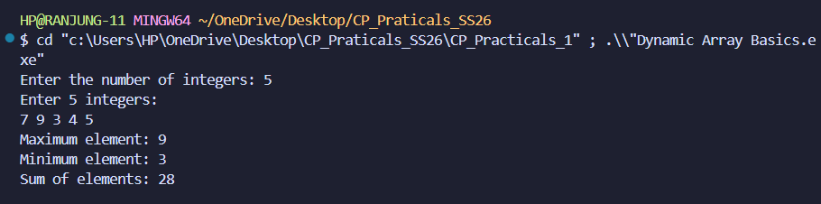

# Question Analysis Template

## Questions

### Question 1: Dynamic Array Basics

#### Problem Summary
Read N integers, store them in a dynamic container (vector), and calculate the maximum element, minimum element, and sum of all elements.

#### Algorithm Explanation
1. Read the count of integers (N) from the user
2. Create a vector of size N to dynamically allocate memory
3. Read N integers and store them in the vector using a loop
4. Initialize variables for max, min, and sum with the first element
5. Iterate through all elements:
   - Update max if current element is greater
   - Update min if current element is smaller
   - Add current element to sum
6. Display the results

#### Time Complexity Analysis
- **Worst Case**: O(n)
- **Best Case**: O(n)
- **Average Case**: O(n)
- **Explanation**: The algorithm must read and process all N integers exactly once. The loop runs n times, and all operations inside (comparisons, additions) are constant time O(1).

#### Space Complexity Analysis
- **Space Used**: O(n)
- **Explanation**: A vector of size N stores all N integers, requiring O(n) memory. The additional variables (maxElement, minElement, sum, i) use O(1) constant space.

#### Reflection on How You Solved the Problem or What You Learnt
This problem introduced me to using vectors for dynamic memory allocation in C++. Unlike fixed-size arrays, vectors automatically manage memory based on the input size. I learned that using a range-based for loop simplifies iteration and improves code readability. The single-pass algorithm demonstrates an efficient approach—we calculate all three values (max, min, sum) in one traversal rather than three separate loops, optimizing both time and cache performance.

#### Program Output

