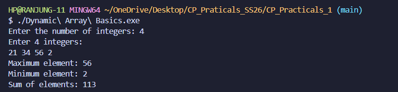
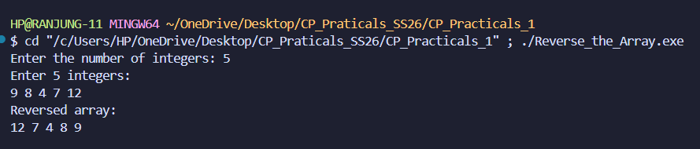
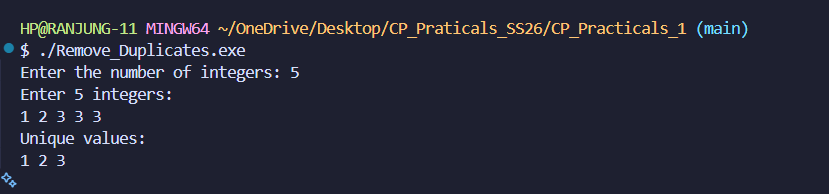
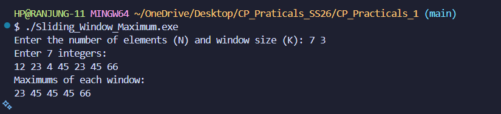
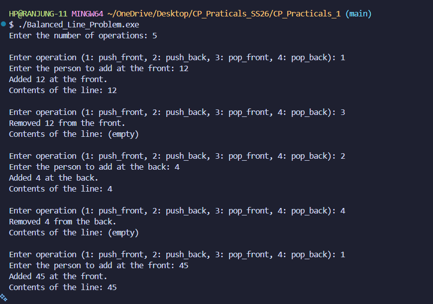
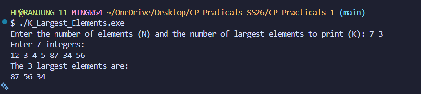
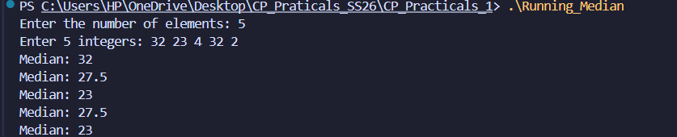
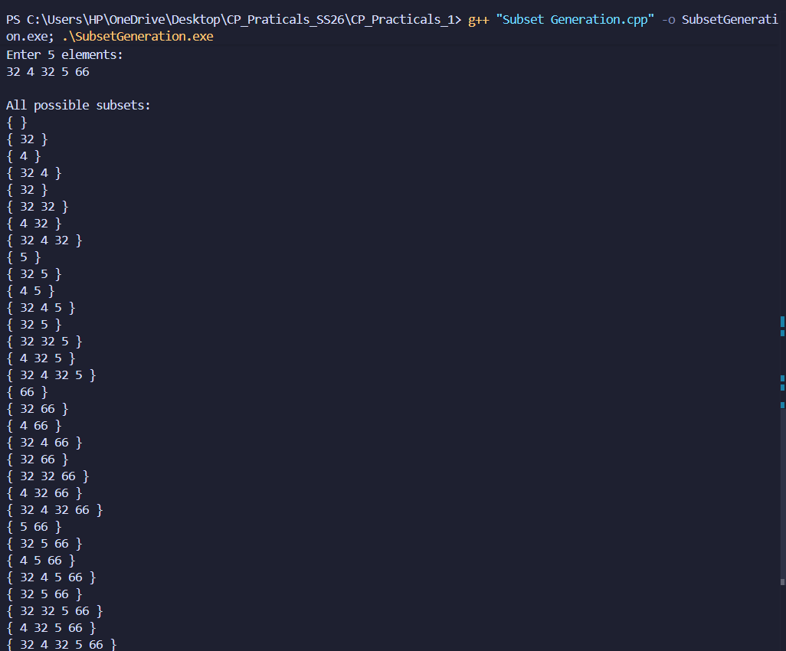

# Question Analysis Template

## Questions

### Question 1: Dynamic Array Basics

#### Problem Summary
Read N integers, store them in a dynamic container (vector), and calculate the maximum element, minimum element, and sum of all elements.

#### Algorithm Explanation
1. Read the count of integers (N) from the user
2. Create a vector of size N to dynamically allocate memory
3. Read N integers and store them in the vector using a loop
4. Initialize variables for max, min, and sum with the first element
5. Iterate through all elements:
   - Update max if current element is greater
   - Update min if current element is smaller
   - Add current element to sum
6. Display the results

#### Time Complexity Analysis
- **Time Complexity**: O(n)
- **Explanation**: We need to go through each of the integer one by one. That means we need to look at every integer exactly once to determine the max, min, and sum. Therefore, the time complexity is linear with respect to the number of integers, So the total time it takes is O(n).

#### Space Complexity Analysis
- **Space Used**: O(n)
- **Explanation**: We store all the integer in a list that can hold N integers. This takes up O(n) space. I used few variable to store the max, min and sum, but that takes constant space O(1). So the overall space complexity is O(n) because of the vector that holds the integers.

#### Reflection on How You Solved the Problem or What I Learnt

This problem hepled me to understand about the vector in C++. Vector are really usefull for dynamic memory allocation. This is because vector can manage memory on their own based on the size of the input data. I understand that the vector are better than array because vector makes it east to add or remove things.

Initially, I used three seperate loops to find max, min nad sum that takes O(3n) time. But after optimizing with a single-pass alogorithm, I calculated all three values in one traversal, reducing the effective operations from O(3n) to O(n). This is because we can find max, min and sum in one go by iterating through the vector only once.

#### Program Output

### Question 2: Reverse the Array 

#### Problem Summary
Read N integers, store them in a vector, and print the array in reverse order. The task requires reversing the sequence without using built-in reverse functions, demonstrating reverse traversal concepts.

#### Algorithm Explanation
1. Read the count of integers (N) from the user
2. Create a vector of size N to store the integers
3. Read N integers and store them in the vector using a loop (index 0 to N-1)
4. Traverse the vector in reverse order using a loop starting from index (N-1) down to 0
5. Print each element during the reverse traversal

#### Time Complexity Analysis
- **Time Complexity**: O(n)
- **Explanation**: We read N integers into the vector (O(n)) and then traverse them in reverse (O(n)). Both operations are linear, so the total time complexity is O(n).

#### Space Complexity Analysis
- **Space Used**: O(n)
- **Explanation**: A vector of size N stores all N integers, requiring O(n) memory. We use a loop variable that takes O(1) constant space. So the overall space complexity is O(n) because of the vector.

#### Reflection on How You Solved the Problem or What I Learnt
This problem helped me understand reverse traversal using vectors. Initially, I thought I needed to create a new reversed array. But using a simple backward loop from (N-1) to 0 is more efficient. The solution prints elements in reverse order without extra space, achieving O(n) time with O(n) space for storage only. This teaches the importance of choosing the right loop direction for efficient solutions.

#### Program Output

### Question 3: Remove Duplicates

#### Problem Summary
Read N integers, remove duplicate values from the array, and print only the unique elements. The task requires sorting the array and using an algorithm to eliminate duplicates while maintaining order.

#### Algorithm Explanation
1. Read the count of integers (N) from the user
2. Create a vector of size N and store all N integers
3. Sort the vector using the sort() function to group duplicates together
4. Use the unique() function to rearrange the vector, moving unique elements to the front and returning an iterator to the new end
5. Use erase() to remove the duplicate elements from the vector
6. Print only the unique values

#### Time Complexity Analysis
- **Time Complexity**: O(n log n)
- **Explanation**: The sorting operation takes O(n log n) time, which dominates the algorithm. The unique() function takes O(n) linear time to traverse and rearrange elements. The erase() operation also takes O(n) time in the worst case. So the overall time complexity is O(n log n) due to sorting.

#### Space Complexity Analysis
- **Space Used**: O(n)
- **Explanation**: A vector of size N stores all N integers, requiring O(n) memory. The unique() and sort() functions work in-place on the existing vector without requiring extra space. So the overall space complexity is O(n) for the vector storage.

#### Reflection on How You Solved the Problem or What I Learnt
This problem helped me understand how sorting and the unique() function work together to remove duplicates efficiently. Initially, I thought about using a brute force approach with nested loops to find duplicates (O(n²)). But by using sort() followed by unique(), I achieved O(n log n) complexity. This teaches the importance of choosing the right STL functions and understanding that preprocessing data (sorting) can simplify duplicate removal significantly.

#### Program Output

### Question 4: Sliding Window Maximum

#### Problem Summary
Given N integers and a window size K, find the maximum element in each sliding window of size K. For each position, the window moves one step to the right, and we need to output the maximum element in each window without recalculating from scratch.

#### Algorithm Explanation
1. Read the number of elements (N) and the window size (K) from the user
2. Read N integers and store them in a vector
3. Create a deque to store indices of useful elements (maintaining a monotonic decreasing order)
4. For each element in the array:
   - Remove indices from the front of deque that are out of the current window (index <= i - K)
   - Remove indices from the back of deque whose values are less than the current element
   - Add the current index to the back of deque
   - If we've processed at least K elements, add the value at the front index to the result (maximum of current window)
5. Print all the maximums

#### Time Complexity Analysis
- **Time Complexity**: O(n)
- **Explanation**: Each element is added to the deque exactly once and removed exactly once. Although we have while loops, each element contributes at most 2 operations (one add, one remove). So the total time complexity is O(n), which is much better than a brute force O(n*k) approach.

#### Space Complexity Analysis
- **Space Used**: O(n)
- **Explanation**: The vector stores N integers requiring O(n) space. The deque stores indices of elements, in the worst case O(k) elements for a window of size K. The result vector stores (n-k+1) maximums. So the overall space complexity is O(n).

#### Reflection on How You Solved the Problem or What I Learnt
This problem helped me understand how a deque can maintain a sliding window maximum efficiently. Initially, I tried a brute force approach where I calculated the maximum for each window separately (O(n*k)). But after using a deque to maintain a monotonic decreasing order of indices, I achieved O(n) complexity. The key insight is that we don't need to recalculate every window's maximum from scratch—we can maintain useful elements in the deque and discard useless ones. This significantly improves performance for large arrays.

#### Program Output

### Question 5: Balanced Line Problem

#### Problem Summary
Simulate a line where people can join or leave from either end. Support operations to add people at the front or back, and remove people from the front or back. After each operation, display the current state of the line.

#### Algorithm Explanation
1. Create a deque to store people in the line
2. Read the number of operations to perform
3. For each operation:
   - If operation is 1: add person at the front using pushFront() function
   - If operation is 2: add person at the back using pushBack() function
   - If operation is 3: remove person from the front using popFront() function
   - If operation is 4: remove person from the back using popBack() function
4. After each operation, call printLine() to display the current contents of the line
5. Use separate functions instead of switch statements for cleaner, modular code

#### Time Complexity Analysis
- **Time Complexity**: O(n)
- **Explanation**: Each operation (push_front, push_back, pop_front, pop_back) takes O(1) constant time in a deque. With n operations total and an additional O(n) to print the line after each operation, the overall complexity is O(n²) in worst case when printing all operations, but each individual operation is O(1).

#### Space Complexity Analysis
- **Space Used**: O(n)
- **Explanation**: The deque stores all people in the line. In the worst case, if we only perform push operations, the deque will store n people, requiring O(n) memory. Pop operations reduce this size. So the overall space complexity is O(n).

#### Reflection on How You Solved the Problem or What I Learnt
This problem helped me understand the advantages of deques for double-ended operations. Initially, I used a switch statement with case blocks that were hard to read. By refactoring into separate functions (pushFront, pushBack, popFront, popBack, printLine), the code became more modular and maintainable. This approach demonstrates the importance of code organization and reusability. The deque data structure was perfect for this problem because it provides O(1) operations at both ends, unlike vectors which have O(n) performance for front operations.

#### Program Output

### Question 6: K Largest Elements

#### Problem Summary
Given N integers and a value K, find and print the K largest elements from the array. The elements should be output in descending order (largest first) using an efficient data structure to avoid recalculating multiple times.

#### Algorithm Explanation
1. Read the number of elements (N) and K (how many largest elements to find)
2. Create a priority_queue (max heap) to store the elements
3. Read all N integers and insert them into the priority_queue
4. Extract the top K elements from the priority_queue and print them
5. Each extraction automatically gives the largest remaining element

#### Time Complexity Analysis
- **Time Complexity**: O(n log n + k log n)
- **Explanation**: Building the max heap takes O(n log n) time. Extracting K elements takes O(k log n) time because each pop() operation on a heap takes O(log n). So the total time complexity is O(n log n + k log n). For K=n, this becomes O(n log n), which is better than sorting and picking the first K elements.

#### Space Complexity Analysis
- **Space Used**: O(n)
- **Explanation**: The priority_queue stores all N elements, requiring O(n) memory. No additional data structures are used. So the overall space complexity is O(n).

#### Reflection on How You Solved the Problem or What I Learnt
This problem helped me understand how priority queues (heaps) can efficiently find K largest elements. Initially, I could have sorted the entire array (O(n log n)) and picked the first K elements. But using a priority_queue achieves the same result with cleaner code. I learned that priority_queue in C++ is a max heap by default, which is perfect for this problem, we can simply pop K times to get the K largest elements in descending order. This approach is especially efficient when K is much smaller than N.

#### Program Output

### Question 7: Running Median

#### Problem Summary
Given a stream of N integers arriving one at a time, find and print the median after each insertion. The median is the middle value when the data is sorted. For an odd number of elements, it's the middle element. For an even number, it's the average of the two middle elements.

#### Algorithm Explanation
1. Create two priority queues:
   - **maxHeap**: stores the smaller half of elements (max heap)
   - **minHeap**: stores the larger half of elements (min heap)
2. For each new integer:
   - Add it to the appropriate heap based on comparison with maxHeap's top
   - Balance the heaps so that maxHeap has either equal elements or one more than minHeap
   - Calculate and print the median:
     - If heaps have equal size: median = (maxHeap.top() + minHeap.top()) / 2
     - If maxHeap has more: median = maxHeap.top()

#### Time Complexity Analysis
- **Time Complexity**: O(n log n)
- **Explanation**: For each of the N elements, we perform heap insertion and balancing operations, both taking O(log n) time. Processing N elements gives O(n log n) total time. This is much better than sorting after each insertion (which would be O(n² log n)).

#### Space Complexity Analysis
- **Space Used**: O(n)
- **Explanation**: We store all N elements split between two heaps (maxHeap and minHeap), requiring O(n) total memory. Both heaps combined store all elements exactly once. So the overall space complexity is O(n).

#### Reflection on How You Solved the Problem or What I Learnt
This problem taught me how to use two heaps to maintain a running median efficiently. Initially, I might have sorted the entire array after each insertion, which would be O(n² log n). But the two-heap approach is much smarter: we maintain the invariant that the smaller half is in maxHeap and the larger half is in minHeap. The key insight is that we don't need to sort, we only need to track the middle elements. Balancing the heaps ensures we can always access the median in O(1) time after O(log n) insertion. This demonstrates the power of choosing the right data structure: heaps are perfect for "always know the middle value" problems.

#### Program Output
The program reads N integers one at a time and outputs the running median after each insertion with 1 decimal place precision.

### Question 8: Subset Generation

#### Problem Summary
Given a set of N numbers, generate and print all possible subsets. For N elements, there are 2^N possible subsets including the empty set. The task is to display each subset in a clear format.

#### Algorithm Explanation
1. Read the number of elements (N) and the N elements themselves
2. Calculate the total number of subsets: 2^N using bit shift `1 << N`
3. For each mask from 0 to 2^N - 1:
   - Check each bit position i in the mask (0 to N-1)
   - If bit i is set (using `mask & (1 << i)`), include elements[i] in the current subset
   - Print the current subset in curly braces
4. Continue until all 2^N subsets are generated

#### Time Complexity Analysis
- **Time Complexity**: O(n × 2^n)
- **Explanation**: We generate 2^n subsets, and for each subset, we check n bits to determine which elements to include. So the total time is O(n × 2^n). This is optimal because we must print all 2^n subsets, and each takes O(n) time to construct.

#### Space Complexity Analysis
- **Space Used**: O(n)
- **Explanation**: We store the N input elements in a vector, requiring O(n) space. The bitmask variables and loop counters use O(1) constant space. We don't use any additional data structures to store all subsets. So the overall space complexity is O(n).

#### Reflection on How You Solved the Problem or What You Learnt
This problem helped me master the bitmask technique for subset generation. Initially, I could have used recursion/backtracking to generate subsets (also valid). But using bitmasks is more elegant and efficient—each number from 0 to 2^n-1 directly represents a unique subset. The bit pattern tells us exactly which elements to include. I learned that bit manipulation with `mask & (1 << i)` is a powerful technique for iterating through combinations. This approach demonstrates how mathematical properties (binary representation) can solve complex problems elegantly.

#### Program Output

### Question 9: Count Subsets with Even Sum

#### Problem Summary
Given N numbers, count how many of the 2^N possible subsets have an even sum. A subset has an even sum if the sum of all its elements is divisible by 2. This includes the empty set (which has sum 0, an even number).

#### Algorithm Explanation
1. Read the number of elements (N) and the N elements themselves
2. Initialize a counter to 0
3. For each mask from 0 to 2^N - 1:
   - Calculate the sum of the subset represented by the mask
   - For each bit position i, if bit i is set in the mask, add elements[i] to the sum
   - Check if the sum is even (sum % 2 == 0)
   - If even, increment the counter
4. Print the total count of subsets with even sum

#### Time Complexity Analysis
- **Time Complexity**: O(n × 2^n)
- **Explanation**: We iterate through all 2^n possible subsets. For each subset, we check n bits to calculate the sum. Therefore, the total time complexity is O(n × 2^n). This is optimal since we need to examine all 2^n subsets.

#### Space Complexity Analysis
- **Space Used**: O(n)
- **Explanation**: We store the N input elements in a vector, requiring O(n) space. The variables for mask and sum use O(1) constant space. We don't use any additional data structures to store subsets. So the overall space complexity is O(n).

#### Reflection on How I Solved the Problem or What I Learnt
This problem reinforced the bitmask technique combined with conditional counting. Initially, I could have generated all subsets and checked each one separately. But using the bitmask approach, I generate and check each subset in one pass. The key insight is that the bitmask directly encodes which elements to include, making it efficient. I also learned that solving this problem required understanding both subset generation and parity checking. The even sum condition (sum % 2 == 0) is efficiently checked in O(1) time, making the overall solution clean and optimal.

#### Program Output

